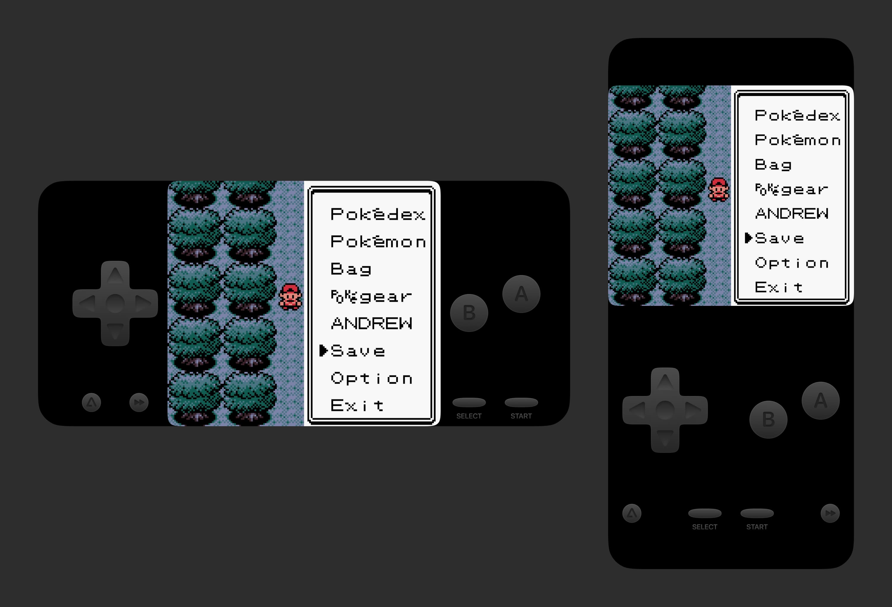
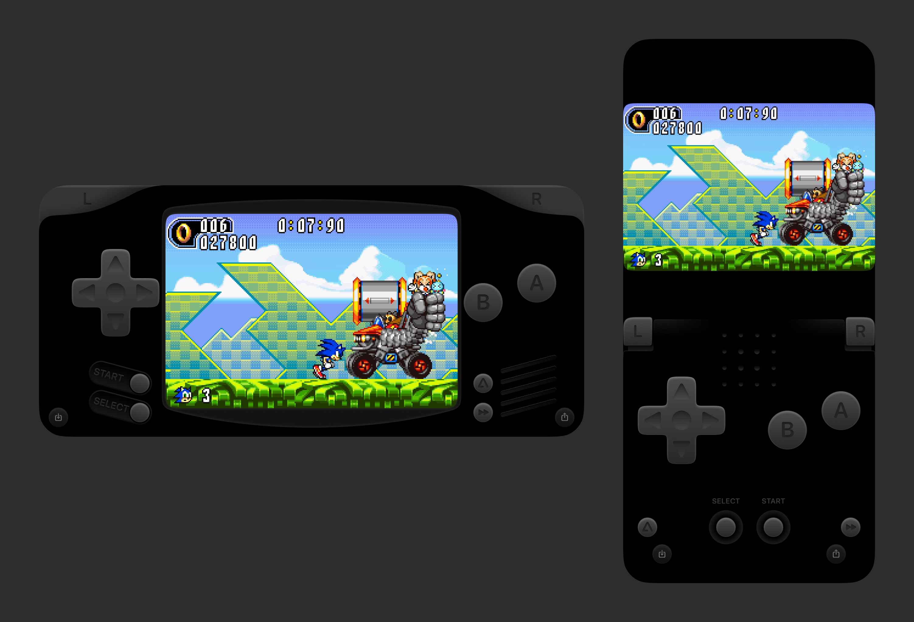

Absorb is a Gameboy Color and Gameboy Advance skin for the iOS emulator Delta. It maximizes screen size in landscape and portrait and is optimized for OLED displays.

## Supported and tested ✅

**Gameboy Color**

- [x] iPhone with Face ID (X to 15)
    - [x] Landscape
    - [x] Portrait

**Gameboy Advance**

- [x] iPhone with Face ID (X to 15)
    - [x] Landscape
    - [x] Portrait

## Supported but untested ⚠️
I don’t have any of these phones to test so it might not work perfectly. It reuses the layout and design from the Face ID layouts.

**Gameboy Color**

- [x] iPhone with Touch ID (7, 8, SE 2)
    - [x] Landscape
    - [x] Portrait

## Someday
Until I design these, other devices will use the default skin from Delta (created by Caroline Moore).

**Gameboy Color**

- [ ] iPhone with Touch ID (7, 8, SE 2)
    - [ ] Landscape
    - [ ] Portrait

- [ ] iPad
    - [ ] Landscape
    - [ ] Portrait
    - [ ] Splitview

**Gameboy Advance**

- [ ] iPhone with Touch ID (7, 8, SE 2)
    - [ ] Landscape
    - [ ] Portrait

- [ ] iPad
    - [ ] Landscape
    - [ ] Portrait
    - [ ] Splitview

---

## Download
- [Absorb-GBC.deltaskin](https://github.com/AndrewHaglund/delta-absorb/blob/main/Absorb-GBC.deltaskin)
- [Absorb-GBA.deltaskin](https://github.com/AndrewHaglund/delta-absorb/blob/main/Absorb-GBA.deltaskin)

---

If you like the skin please consider [donating](https://ko-fi.com/haglund) a few bucks. (No pressure!) Andrew has a [blog](https://haglund.app) where he writes sometimes about design, games, and other things.

---

## Documentation

The JSON and PDFs are based originally from [Riley’s documentation](https://noah978.gitbook.io/delta-docs/skins).

## Acknowledgements

The skin uses Apple’s [SF Pro Rounded](https://developer.apple.com/fonts/) typeface for button labels.

JSON files were edited using Simon Støvring’s excellent JSON editor, [Jayson](https://jayson.app).

Designs created in Figma.